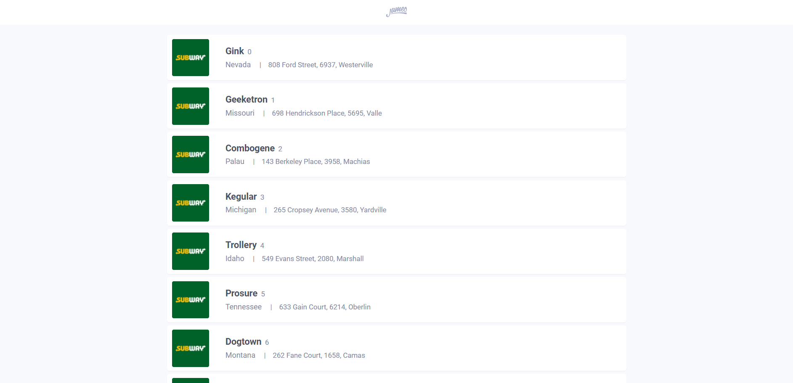

<h1 align="center">
	
</h1>

<h3 align="center">
	Front-end Challenge 
</h3>

<p align="center">
	 
</p>

## Overview

- Application to manage establishments information developed for the <a href="https://github.com/james-delivery/frontend-challenge">James' front-end challenge</a>.
- It must be built with Angular but I don't know Angular... yet. I really like to learn new techs and I'm already studying this framework. For now, I'm using React.
- The application consume this <a href="https://my-json-server.typicode.com/james-delivery/frontend-challenge">API</a>.

## Installation and usage

**By convenience, the app is already deployed here [Front-end Challenge](https://frontend-challenge-james.vercel.app/).**

The app requires latest [Node.js](https://nodejs.org/) LTS version or more recent.
[Yarn package manager](https://yarnpkg.com/) is also recommended.  

### Running from source

The following commands install and run the development version of this application:

```sh
git clone https://github.com/geankaminski/frontend-challenge-james.git
cd frontend-challenge-james
yarn install
yarn start
```

After this, you can access by any browser the address <a href="http://localhost:3000/">http://localhost:3000/</a>.


